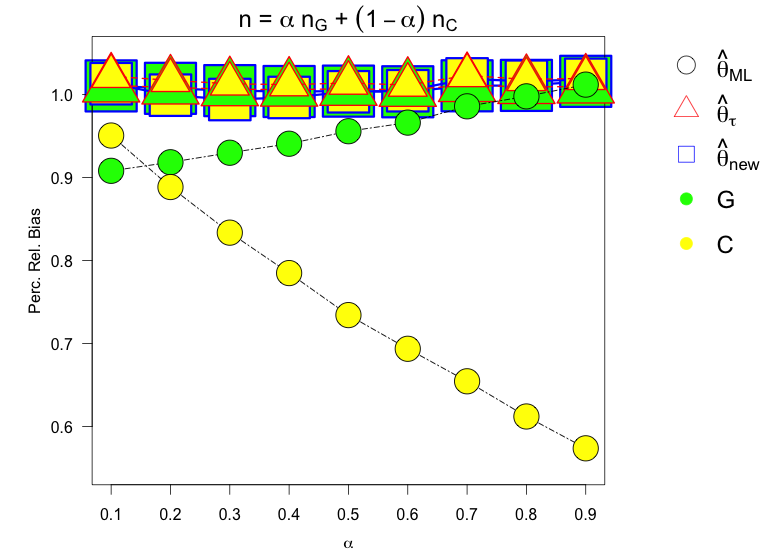

[](http://quantlet.de/index.php?p=info)

## [](http://quantlet.de/) **COPSimStuPercRelBiasMix** [](http://quantlet.de/d3/ia)


```yaml

Name of Quantlet: COPSimStuPercRelBiasMix

Published in: Estimation of the Dependence Parameter in Bivariate Archimedean
              Copula Models under Misspecification

Description: Plots the percentage relative bias of the estimates obtained for 
             the copula dependence parameter theta in a simulation study
             using ML, the inversion of Kendall's tau, and a p-value weighted
             average of the two in combination with the Gumbel and the
             Clayton copula. The observations come from convex sums of
             Gumbel and Clayton. The estimator is indicated by line colour
             and shape, the copula used in estimation is indicated by the
             fill colour of each shape.

Keywords: Copula, Gumbel, Frank, Clayton, estimation, dependence parameter,
          misspecification, simulation study, mixture

See also: COPtautotheta

Author: Verena Weber

Submitted: 

Datafile: ResMix0.1.txt, ResMix0.2.txt, ResMix0.3.txt, ResMix0.4.txt, 
          ResMix0.5.txt, ResMix0.6.txt, ResMix0.7.txt, ResMix0.8.txt, 
          ResMix0.9.txt

Input: ResMix0.1.txt, ResMix0.2.txt, ResMix0.3.txt, ResMix0.4.txt, 
       ResMix0.5.txt, ResMix0.6.txt, ResMix0.7.txt, ResMix0.8.txt, 
       ResMix0.9.txt

Output: Returns a plot of the percentage relative bias for each 
        estimator in combination with each copula as a function 
        of alpha.

```





```R
# Close windows and clear variables
rm(list = ls(all = TRUE))
graphics.off()

# If necessary, please install the following package.
# install.packages("copula")

library(copula)

# Load results from simulation study
res.mix.0.1  = read.table("ResMix0.1.txt", header = TRUE)
res.mix.0.2  = read.table("ResMix0.2.txt", header = TRUE)
res.mix.0.3  = read.table("ResMix0.3.txt", header = TRUE)
res.mix.0.4  = read.table("ResMix0.4.txt", header = TRUE)
res.mix.0.5  = read.table("ResMix0.5.txt", header = TRUE)
res.mix.0.6  = read.table("ResMix0.6.txt", header = TRUE)
res.mix.0.7  = read.table("ResMix0.7.txt", header = TRUE)
res.mix.0.8  = read.table("ResMix0.8.txt", header = TRUE)
res.mix.0.9  = read.table("ResMix0.9.txt", header = TRUE)

theta.C.0.5 = iTau(claytonCopula(), 0.5)
theta.G.0.5 = iTau(gumbelCopula(), 0.5)

alpha = seq(from = 0.1, to = 0.9, by = 0.1 )

rel.bias.plot = function(x.1, x.2, x.3, x.4, x.5, x.6, x.7, x.8, x.9, true.theta, 
                         copula, estim.method) {
  if ((estim.method == "ML") & (copula == "gumbel")) {
    Rel.Bias.ML.gumbel = c(mean(x.1$theta.G.ml/true.theta), mean(x.2$theta.G.ml/true.theta), 
                           mean(x.3$theta.G.ml/true.theta), mean(x.4$theta.G.ml/true.theta), 
                           mean(x.5$theta.G.ml/true.theta), mean(x.6$theta.G.ml/true.theta), 
                           mean(x.7$theta.G.ml/true.theta), mean(x.8$theta.G.ml/true.theta), 
                           mean(x.9$theta.G.ml/true.theta))
    return(Rel.Bias.ML.gumbel)
  } else if ((estim.method == "ML") & (copula == "clayton")) {
    Rel.Bias.ML.clayton = c(mean(x.1$theta.C.ml/true.theta), mean(x.2$theta.C.ml/true.theta), 
                            mean(x.3$theta.C.ml/true.theta), mean(x.4$theta.C.ml/true.theta), 
                            mean(x.5$theta.C.ml/true.theta), mean(x.6$theta.C.ml/true.theta), 
                            mean(x.7$theta.C.ml/true.theta), mean(x.8$theta.C.ml/true.theta), 
                            mean(x.9$theta.C.ml/true.theta))
    return(Rel.Bias.ML.clayton)
  } else if ((estim.method == "tau") & (copula == "gumbel")) {
    Rel.Bias.tau.gumbel = c(mean(x.1$theta.G.tau/true.theta), mean(x.2$theta.G.tau/true.theta), 
                            mean(x.3$theta.G.tau/true.theta), mean(x.4$theta.G.tau/true.theta), 
                            mean(x.5$theta.G.tau/true.theta), mean(x.6$theta.G.tau/true.theta), 
                            mean(x.7$theta.G.tau/true.theta), mean(x.8$theta.G.tau/true.theta), 
                            mean(x.9$theta.G.tau/true.theta))
    return(Rel.Bias.tau.gumbel)
  } else if ((estim.method == "tau") & (copula == "clayton")) {
    Rel.Bias.tau.clayton = c(mean(x.1$theta.C.tau/true.theta), mean(x.2$theta.C.tau/true.theta), 
                             mean(x.3$theta.C.tau/true.theta), mean(x.4$theta.C.tau/true.theta), 
                             mean(x.5$theta.C.tau/true.theta), mean(x.6$theta.C.tau/true.theta), 
                             mean(x.7$theta.C.tau/true.theta), mean(x.8$theta.C.tau/true.theta), 
                             mean(x.9$theta.C.tau/true.theta))
    return(Rel.Bias.tau.clayton)
  } else if ((estim.method == "new") & (copula == "gumbel")) {
    Rel.Bias.new.gumbel = c(mean(x.1$theta.G.new/true.theta), mean(x.2$theta.G.new/true.theta), 
                            mean(x.3$theta.G.new/true.theta), mean(x.4$theta.G.new/true.theta), 
                            mean(x.5$theta.G.new/true.theta), mean(x.6$theta.G.new/true.theta), 
                            mean(x.7$theta.G.new/true.theta), mean(x.8$theta.G.new/true.theta), 
                            mean(x.9$theta.G.new/true.theta))
    return(Rel.Bias.new.gumbel)
  } else if ((estim.method == "new") & (copula == "clayton")) {
    Rel.Bias.new.clayton = c(mean(x.1$theta.C.new/true.theta), mean(x.2$theta.C.new/true.theta), 
                             mean(x.3$theta.C.new/true.theta), mean(x.4$theta.C.new/true.theta), 
                             mean(x.5$theta.C.new/true.theta), mean(x.6$theta.C.new/true.theta), 
                             mean(x.7$theta.C.new/true.theta), mean(x.8$theta.C.new/true.theta), 
                             mean(x.9$theta.C.new/true.theta))
    return(Rel.Bias.new.clayton)
  }
}


reset = function() {
  par(mfrow = c(1, 1), oma = c(0, 0, 0, 0), mar = c(0, 0, 0, 0), new = TRUE)
  plot(0:1, 0:1, type = "n", xlab = " ", ylab = " ", axes = FALSE)
}

legend1 = c(expression(paste(hat(theta)["ML"])), expression(paste(hat(theta)[tau])), 
            expression(paste(hat(theta)["new"])), "G", "C")

main1 = expression(paste(n, " ", "= ", alpha, " ", n["G"], " ", "+", " ", (1 - alpha), 
                         " ", n["C"]))

par(fig = c(0, 1, 0, 1), oma = c(0, 0, 0, 0), mar = c(3.4, 4.8, 1.9, 3.4), new = TRUE)


par(xpd = T, mar = par()$mar + c(0, 0, 0, 5))
plot(alpha, rel.bias.plot(res.mix.0.1, res.mix.0.2, res.mix.0.3, res.mix.0.4, res.mix.0.5, 
                          res.mix.0.6, res.mix.0.7, res.mix.0.8, res.mix.0.9, theta.C.0.5, "gumbel", "new"), 
     type = "b", pch = 22, main = main1, lty = "solid", bg = "green", col = "blue", 
     cex = 8, ylim = c(0.55, 1.05), lwd = 3, cex.main = 1.5, las = 1, xlab = expression(alpha), 
     xaxt = "n", mgp = c(2.5, 1, 0), ylab = "Perc. Rel. Bias")
axis(1, at = alpha)

points(alpha, rel.bias.plot(res.mix.0.1, res.mix.0.2, res.mix.0.3, res.mix.0.4, res.mix.0.5, 
                            res.mix.0.6, res.mix.0.7, res.mix.0.8, res.mix.0.9, theta.C.0.5, "clayton", "new"), 
       type = "b", pch = 22, lty = "solid", col = "blue", bg = "yellow", cex = 6.5, 
       lwd = 3)

points(alpha, rel.bias.plot(res.mix.0.1, res.mix.0.2, res.mix.0.3, res.mix.0.4, res.mix.0.5, 
                            res.mix.0.6, res.mix.0.7, res.mix.0.8, res.mix.0.9, theta.C.0.5, "gumbel", "tau"), 
       type = "b", pch = 24, lty = "dashed", col = "red", bg = "green", cex = 5.9, lwd = 1.8)

points(alpha, rel.bias.plot(res.mix.0.1, res.mix.0.2, res.mix.0.3, res.mix.0.4, res.mix.0.5, 
                            res.mix.0.6, res.mix.0.7, res.mix.0.8, res.mix.0.9, theta.C.0.5, "clayton", "tau"), 
       type = "b", pch = 24, lty = "dashed", col = "red", bg = "yellow", cex = 4, lwd = 1.8)


points(alpha, rel.bias.plot(res.mix.0.1, res.mix.0.2, res.mix.0.3, res.mix.0.4, res.mix.0.5, 
                            res.mix.0.6, res.mix.0.7, res.mix.0.8, res.mix.0.9, theta.C.0.5, "gumbel", "ML"), 
       type = "b", pch = 21, lty = "twodash", bg = "green", cex = 3.5, lwd = 1.2)

points(alpha, rel.bias.plot(res.mix.0.1, res.mix.0.2, res.mix.0.3, res.mix.0.4, res.mix.0.5, 
                            res.mix.0.6, res.mix.0.7, res.mix.0.8, res.mix.0.9, theta.C.0.5, "clayton", "ML"), 
       type = "b", pch = 21, lty = "twodash", bg = "yellow", cex = 3.5, lwd = 1.2)


reset()
legend(0.885, 1, legend1, col = c("black", "red", "blue", "green", "yellow"), 
       pch = c(21, 24, 22, 20, 20, 20), bty = "n", cex = 1.5, pt.cex = 2.5)

```
