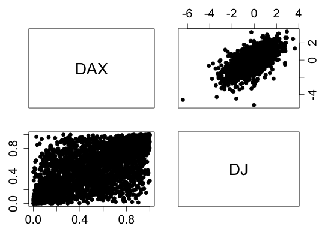
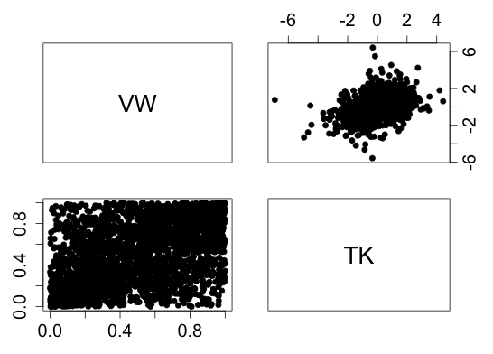

[](http://quantlet.de/index.php?p=info)

## [](http://quantlet.de/) **COPapp2residual** [](http://quantlet.de/d3/ia)


```yaml
Name of Quantlet: COPapp2residual

Published in: Estimation of the Dependence Parameter in Bivariate Archimedean
              Copula Models under Misspecification

Description: COPapp2residual shows pairwise scatter plots of based on
             AR(1)-GJR-GARCH(1,1) / AR(1)-GJR-GARCH(2,1) / fitted residuals. 
             The upper triangular plots show the pairwise residuals
             scatter points. The lower  triangular plots show the scatter
             points computed from empirical cdf of the residuals. The 
             companies Volkswagen (VW) and Thyssen-Krupp (TK) as well as the 
             stock indices DAX and DJIA are contained.                   

Keywords:    Ostap Okhrin, Yafei Xu, Verena Weber

See also:    COPapp1prices, COPapp1return, COPapp1residual

Author:      Ostap Okhrin, Yafei Xu, Verena Weber

Submitted:  

Datafile:    DataDAXDJTKVW.txt

Input:       DataDAXDJTKVW.txt

Output:      COPapp2residual returns pairwise scatter plots from AR-GJR-GARCH 
             residuals (upper triangular) and from residuals mapped on unit 
             square by the empirical cdf (lower triangular), including DAX, 
             DJ, VW, and TK.  
```






```R
graphics.off()
rm(list = ls(all = TRUE))

# please install these packages if necessary
# install.packages("fGarch")
# install.packages("QRM")
# install.packages("copula")

library(fGarch)
library(QRM)
library(copula)

S = read.table("DataDAXDJTKVW.txt", skip = 6, header = T, sep=";")[ ,c(2:5)] 
date.time = read.table("DataDAXDJTKVW.txt", sep=";",  skip=7)[ ,1] 

X = S[-1,]
for(i in 1:length(S[1,]))X[,i] = log(S[-1,i]/S[-length(S[,i]),i]) #compute log returns


feps    = matrix(nrow = dim(X)[1], ncol = dim(X)[2])
eps     = matrix(nrow = dim(X)[1], ncol = dim(X)[2])
eps.squ = matrix(nrow = dim(X)[1], ncol = dim(X)[2])
sigma.t = matrix(nrow = dim(X)[1], ncol = dim(X)[2])

###############################
#### AR(1)-GJR-GARCH(2,1) Fit

#select the indices
sel.pairs = c(1,2) 

params.ind  = matrix(nrow = 2 * dim(X[, sel.pairs])[2], ncol = 14)

for(i in sel.pairs) {
  fit                       = garchFit(~arma(1,0) + aparch(2, 1), 
                              delta = 2, include.delta = FALSE, data = X[, i], 
                              cond.dist = "sged", trace = F)
  eps[, i]                  = fit@residuals
  sigma.t[, i]              = fit@sigma.t
  eps[, i]                  = eps[, i] / sigma.t[, i]   # standardize residuals   
  eps.squ[, i]              = eps[, i]^2 
  params.ind[(2 * i - 1), ] = c(fit@fit$coef, 
                                Box.test(eps[, i], type = "Ljung-Box", lag = 12)$p.value, 
                                Box.test(eps.squ[, i], type = "Ljung-Box", lag = 12)$p.value, 
                                ks.test(eps[, i], "pnorm")$p.value, 
                                ks.test(eps[, i], "psged")$p.value)
  params.ind[(2 * i), ]     = c(fit@fit$matcoef[, 2], NA, NA, NA, NA)
  feps[, i]                 = edf(eps[, i], adjust = TRUE)
}

colnames(params.ind) = c("mu", "ar1", "omega", "alpha1", "alpha2", "gamma1", "gamma2", 
                         "beta1", "skew", "shape", "BL.eps", "BL.eps.squ", "KS.norm", "KS.sged")
rownames(params.ind) = rep(colnames(X[, sel.pairs]), each = 2)

###############################
#### AR(1)-GJR-GARCH(1,1) Fit

#select the stocks
sel.pairs = c(3,4) 

params.sto  = matrix(nrow = 2 * dim(X[, sel.pairs])[2], ncol = 12)

for(i in sel.pairs) {
  fit                       = garchFit(~arma(1,0) + aparch(1, 1), delta = 2, 
                              include.delta = FALSE, data = X[, i], 
                              cond.dist = "sged", trace = F)
  eps[, i]                  = fit@residuals
  sigma.t[, i]              = fit@sigma.t
  eps[, i]                  = eps[, i] / sigma.t[, i]   # standardize residuals   
  eps.squ[, i]              = eps[, i]^2 
  params.sto[(2 * i - 5), ] = c(fit@fit$coef, 
                                Box.test(eps[, i], type = "Ljung-Box", lag = 12)$p.value, 
                                Box.test(eps.squ[, i], type = "Ljung-Box", lag = 12)$p.value, 
                                ks.test(eps[, i], "pnorm")$p.value, 
                                ks.test(eps[, i], "psged")$p.value)
  params.sto[(2 * i - 4), ] = c(fit@fit$matcoef[, 2], NA, NA, NA, NA)
  feps[, i]                 = edf(eps[, i], adjust = TRUE)
}

colnames(params.sto) = c("mu", "ar1", "omega", "alpha1", "gamma1", "beta1", "skew",
                         "shape", "BL.eps", "BL.eps.squ", "KS.norm", "KS.sged")
rownames(params.sto) = rep(colnames(X[, sel.pairs]), each = 2)

#########
# do plot
layout(matrix(1:4, nrow=2, ncol=2, byrow = T))

par(mar=c(1, 3, 3, 1))
plot(0, 0, axes = FALSE, frame = TRUE, col = "white", xlab = "", ylab = "")
text(0, 0, "DAX", cex = 2)

par(mar=c(1, 1.5, 3, 3), pty="m")
plot(eps[, 2], eps[, 1], pch = 19, xlab = "", ylab = "", axes = F,
     frame = T); axis(3, cex.axis=1.5); axis(4, cex.axis=1.5)


par(mar=c(3, 3, 1.5, 1), pty="m")
plot(edf(eps[, 1], F), edf(eps[, 2], F), pch = 19, xlab = "",
     ylab = "", axes = F, frame = T); axis(2, cex.axis=1.5); axis(1, cex.axis=1.5)

par(mar=c(3, 1.5, 1.5, 3), pty="m")
plot(0, 0, axes = FALSE, frame = TRUE, col = "white", xlab = "",
     ylab = "")
text(0, 0, "DJ", cex = 2)

########
layout(matrix(1:4, nrow=2, ncol=2, byrow = T))

par(mar=c(1, 3, 3, 1))
plot(0, 0, axes = FALSE, frame = TRUE, col = "white", xlab = "", ylab = "")
text(0, 0, "VW", cex = 2)

par(mar=c(1, 1.5, 3, 3), pty="m")
plot(eps[, 4], eps[, 3], pch = 19, xlab = "", ylab = "", axes = F,
     frame = T); axis(3, cex.axis=1.5); axis(4, cex.axis=1.5)


par(mar=c(3, 3, 1.5, 1), pty="m")
plot(edf(eps[, 3], F), edf(eps[, 4], F), pch = 19, xlab = "",
     ylab = "", axes = F, frame = T); axis(1, cex.axis=1.5); axis(2, cex.axis=1.5)

par(mar=c(3, 1.5, 1.5, 3), pty="m")
plot(0, 0, axes = FALSE, frame = TRUE, col = "white", xlab = "",
     ylab = "")
text(0, 0, "TK", cex = 2)

```
